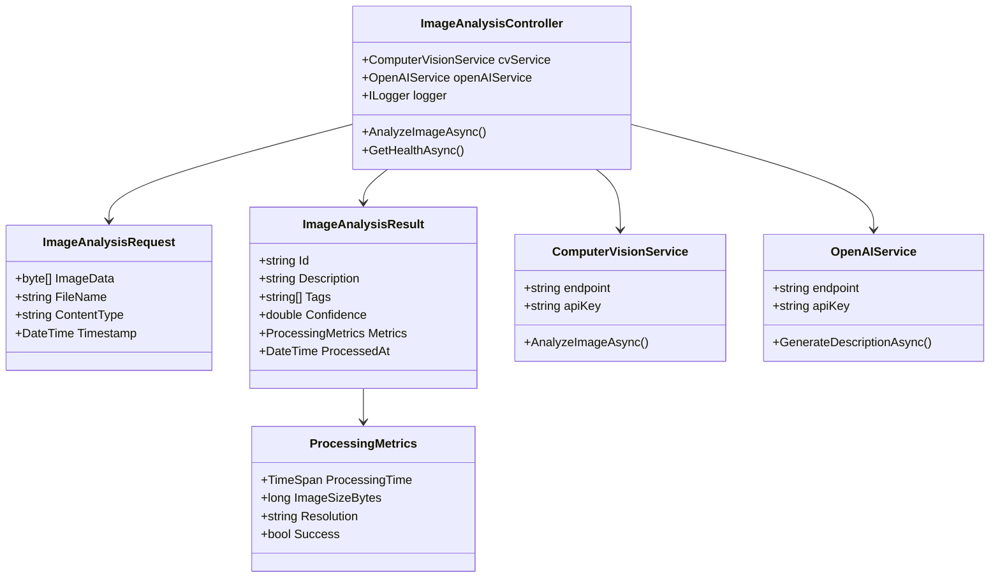

```mermaid
classDiagram
    class ImageAnalysisRequest {
        +byte[] ImageData
        +string FileName
        +string ContentType
        +DateTime Timestamp
    }
    
    class ImageAnalysisResult {
        +string Id
        +string Description
        +string[] Tags
        +double Confidence
        +ProcessingMetrics Metrics
        +DateTime ProcessedAt
    }
    
    class ProcessingMetrics {
        +TimeSpan ProcessingTime
        +long ImageSizeBytes
        +string Resolution
        +bool Success
    }
    
    class ImageAnalysisController {
        +ComputerVisionService cvService
        +OpenAIService openAIService
        +ILogger logger
        +AnalyzeImageAsync()
        +GetHealthAsync()
    }
    
    class ComputerVisionService {
        +string endpoint
        +string apiKey
        +AnalyzeImageAsync()
    }
    
    class OpenAIService {
        +string endpoint
        +string apiKey
        +GenerateDescriptionAsync()
    }
    
    ImageAnalysisController --> ComputerVisionService
    ImageAnalysisController --> OpenAIService
    ImageAnalysisController --> ImageAnalysisRequest
    ImageAnalysisController --> ImageAnalysisResult
    ImageAnalysisResult --> ProcessingMetrics
```
