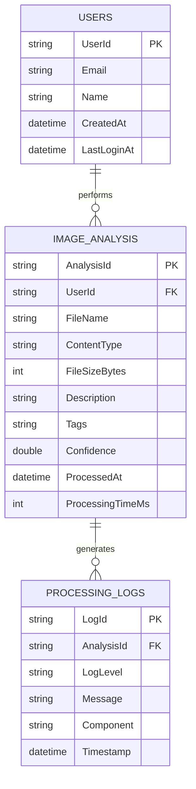

```mermaid
erDiagram
    USERS ||--o{ IMAGE_ANALYSIS : "performs"
    IMAGE_ANALYSIS ||--o{ PROCESSING_LOGS : "generates"
    
    USERS {
        string UserId PK
        string Email
        string Name
        datetime CreatedAt
        datetime LastLoginAt
    }
    
    IMAGE_ANALYSIS {
        string AnalysisId PK
        string UserId FK
        string FileName
        string ContentType
        int FileSizeBytes
        string Description
        string Tags
        double Confidence
        datetime ProcessedAt
        int ProcessingTimeMs
    }
    
    PROCESSING_LOGS {
        string LogId PK
        string AnalysisId FK
        string LogLevel
        string Message
        string Component
        datetime Timestamp
    }
```
