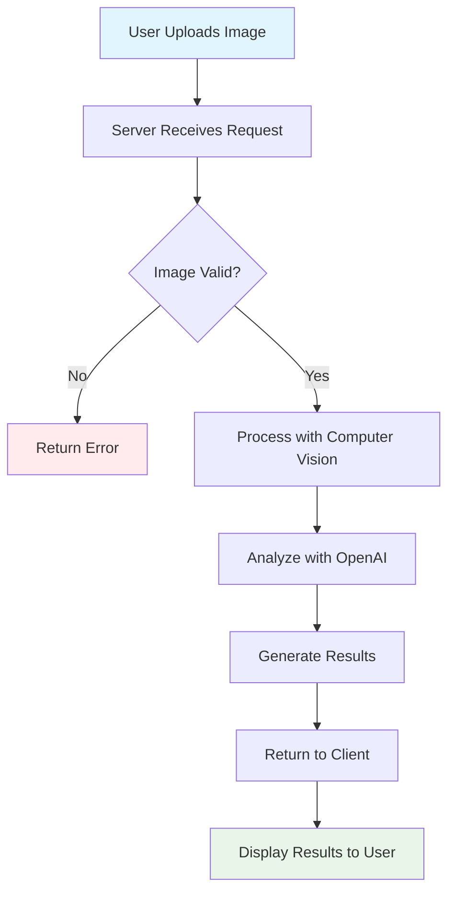

```mermaid
flowchart TD
    A[User Uploads Image] --> B[Server Receives Request]
    B --> C{Image Valid?}
    C -->|No| D[Return Error]
    C -->|Yes| E[Process with Computer Vision]
    E --> F[Analyze with OpenAI]
    F --> G[Generate Results]
    G --> H[Return to Client]
    H --> I[Display Results to User]
    
    style A fill:#e1f5fe
    style I fill:#e8f5e8
    style D fill:#ffebee
```
