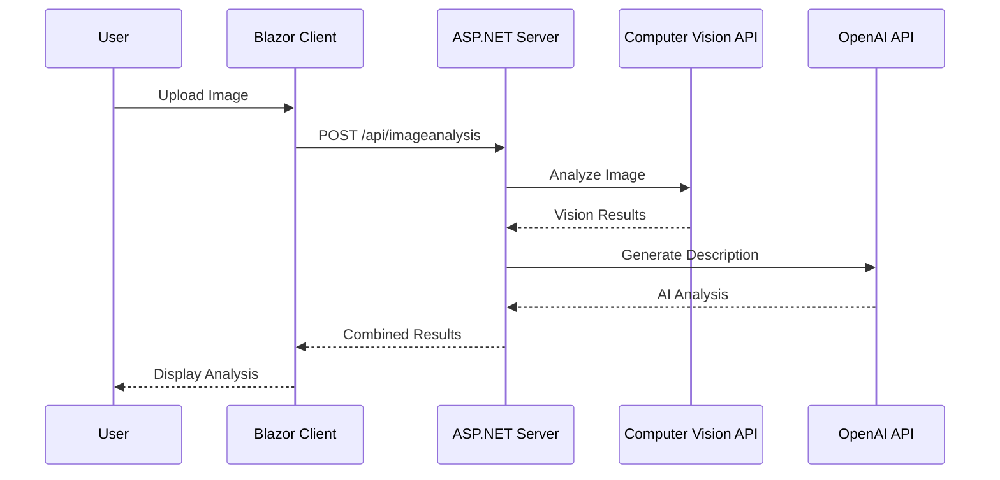

```mermaid
sequenceDiagram
    participant User
    participant Client as Blazor Client
    participant Server as ASP.NET Server
    participant CV as Computer Vision API
    participant AI as OpenAI API
    
    User->>Client: Upload Image
    Client->>Server: POST /api/imageanalysis
    Server->>CV: Analyze Image
    CV-->>Server: Vision Results
    Server->>AI: Generate Description
    AI-->>Server: AI Analysis
    Server-->>Client: Combined Results
    Client-->>User: Display Analysis
```
