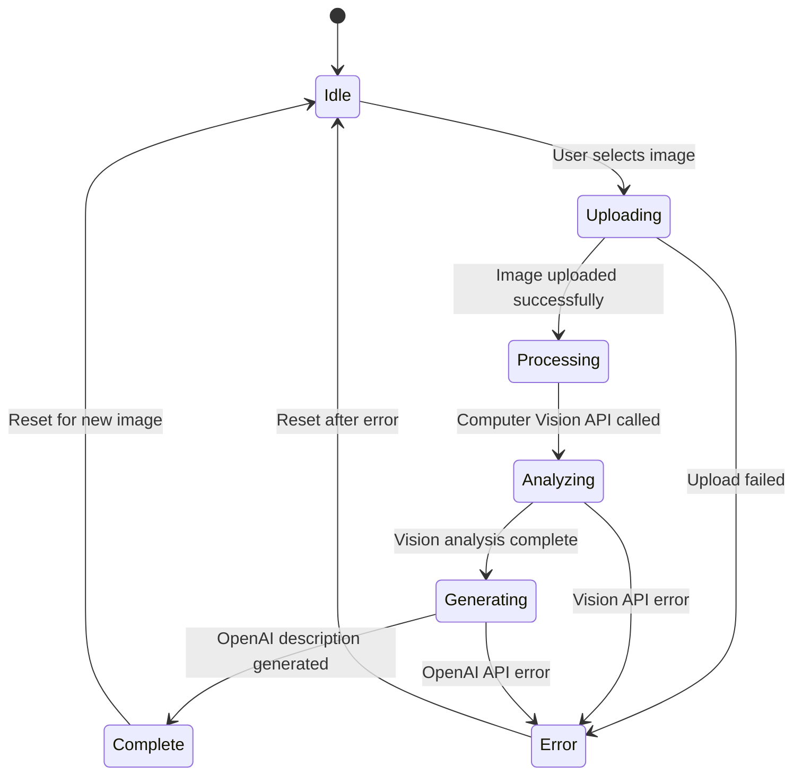

```mermaid
stateDiagram-v2
    [*] --> Idle
    
    Idle --> Uploading : User selects image
    Uploading --> Processing : Image uploaded successfully
    Uploading --> Error : Upload failed
    
    Processing --> Analyzing : Computer Vision API called
    Analyzing --> Generating : Vision analysis complete
    Generating --> Complete : OpenAI description generated
    
    Analyzing --> Error : Vision API error
    Generating --> Error : OpenAI API error
    
    Complete --> Idle : Reset for new image
    Error --> Idle : Reset after error
```
